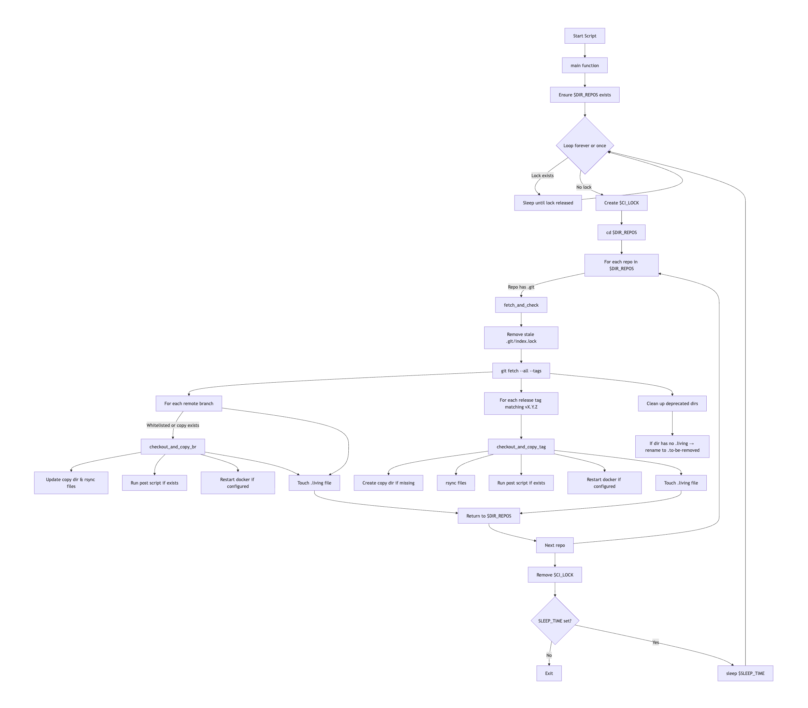
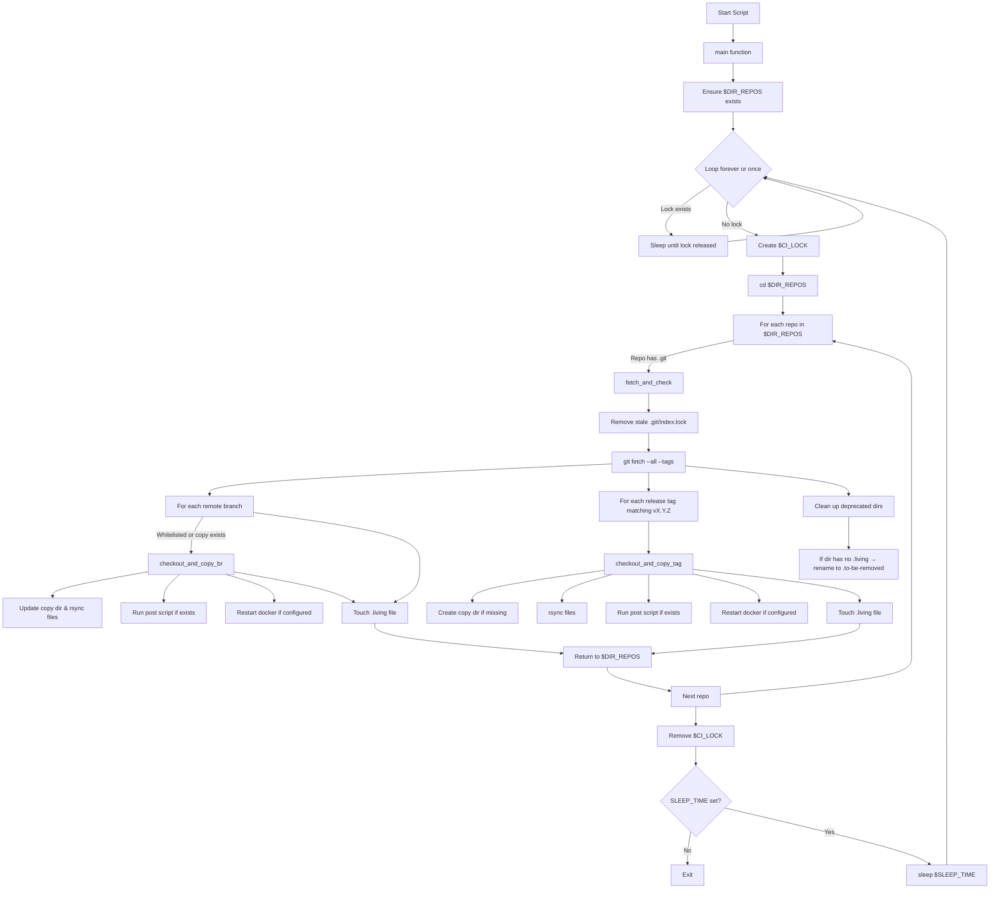
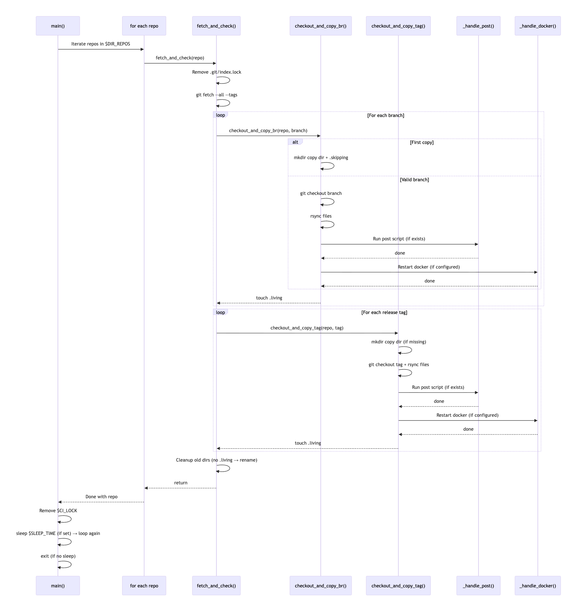

# 部署自动化脚本 - 设计逻辑

## Flow chart





### Source

## Sequence diagram



```mermaid
%% ================================
%% SEQUENCE DIAGRAM (function calls)
%% ================================
sequenceDiagram
    participant Main as main()
    participant RepoLoop as for each repo
    participant Fetch as fetch_and_check()
    participant Branch as checkout_and_copy_br()
    participant Tag as checkout_and_copy_tag()
    participant Post as _handle_post()
    participant Docker as _handle_docker()

    Main->>RepoLoop: Iterate repos in $DIR_REPOS
    RepoLoop->>Fetch: fetch_and_check(repo)

    Fetch->>Fetch: Remove .git/index.lock
    Fetch->>Fetch: git fetch --all --tags

    loop For each branch
        Fetch->>Branch: checkout_and_copy_br(repo, branch)
        alt First copy
            Branch->>Branch: mkdir copy dir + .skipping
        else Valid branch
            Branch->>Branch: git checkout branch
            Branch->>Branch: rsync files
            Branch->>Post: Run post script (if exists)
            Post-->>Branch: done
            Branch->>Docker: Restart docker (if configured)
            Docker-->>Branch: done
        end
        Branch-->>Fetch: touch .living
    end

    loop For each release tag
        Fetch->>Tag: checkout_and_copy_tag(repo, tag)
        Tag->>Tag: mkdir copy dir (if missing)
        Tag->>Tag: git checkout tag + rsync files
        Tag->>Post: Run post script (if exists)
        Post-->>Tag: done
        Tag->>Docker: Restart docker (if configured)
        Docker-->>Tag: done
        Tag-->>Fetch: touch .living
    end

    Fetch->>Fetch: Cleanup old dirs (no .living → rename)

    Fetch-->>RepoLoop: return
    RepoLoop-->>Main: Done with repo

    Main->>Main: Remove $CI_LOCK
    Main->>Main: sleep $SLEEP_TIME (if set) → loop again
    Main->>Main: exit (if no sleep)